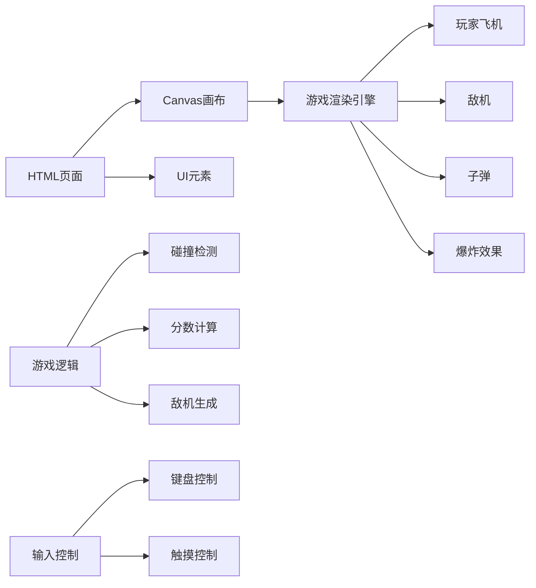

## 1. Architecture Design
这是一个纯前端游戏项目，使用 HTML5 Canvas 和原生 JavaScript 实现，不需要后端服务。



## 2. Technology Description
- **前端**: 原生 JavaScript + HTML5 Canvas + CSS3
- **构建工具**: 无需构建工具，直接使用浏览器运行
- **项目结构**: 单一 HTML 文件，包含 CSS 和 JavaScript
- **浏览器兼容性**: 支持现代浏览器（Chrome, Firefox, Safari, Edge）

## 3. Project Structure
```
/workspace/
├── index.html      # 主游戏文件，包含 HTML、CSS 和 JavaScript
└── .trae/
    └── documents/
        ├── prd.md
        └── arch.md
```

## 4. Game Modules
### 4.1 Game State Management
```javascript
// 游戏状态枚举
const GameState = {
    START: 'start',
    PLAYING: 'playing',
    GAMEOVER: 'gameover'
};

// 游戏数据
let gameData = {
    score: 0,
    lives: 3,
    level: 1,
    state: GameState.START
};
```

### 4.2 Game Objects
```javascript
// 玩家飞机
class Player {
    constructor(x, y) {
        this.x = x;
        this.y = y;
        this.width = 50;
        this.height = 50;
        this.speed = 5;
        this.bullets = [];
    }
}

// 敌机
class Enemy {
    constructor(x, y, type) {
        this.x = x;
        this.y = y;
        this.type = type;
        this.width = 40;
        this.height = 40;
        this.speed = 2;
        this.health = 1;
    }
}

// 子弹
class Bullet {
    constructor(x, y, direction) {
        this.x = x;
        this.y = y;
        this.direction = direction;
        this.speed = 8;
        this.width = 4;
        this.height = 12;
    }
}
```

### 4.3 Collision Detection
```javascript
// 矩形碰撞检测
function checkCollision(rect1, rect2) {
    return rect1.x < rect2.x + rect2.width &&
           rect1.x + rect1.width > rect2.x &&
           rect1.y < rect2.y + rect2.height &&
           rect1.y + rect1.height > rect2.y;
}
```

## 5. Core Functions
| Function Name | Purpose |
|---------------|---------|
| initGame() | 初始化游戏状态和对象 |
| gameLoop() | 主游戏循环，更新和渲染 |
| update() | 更新游戏状态和对象位置 |
| render() | 渲染游戏画面 |
| createEnemies() | 生成敌机 |
| checkCollisions() | 检测所有碰撞 |
| drawPlayer() | 绘制玩家飞机 |
| drawEnemies() | 绘制敌机 |
| drawBullets() | 绘制子弹 |
| drawExplosions() | 绘制爆炸效果 |
| drawStars() | 绘制背景星星 |
| drawUI() | 绘制UI信息（分数、生命） |

## 6. Input Handling
### 6.1 Keyboard Controls
- **Arrow Keys / WASD**: 移动飞机
- **Spacebar**: 射击
- **Enter**: 开始/重新开始游戏

### 6.2 Touch Controls
- **Touch and drag**: 移动飞机
- **Auto-fire**: 自动射击模式

## 7. Performance Optimization
- 使用 requestAnimationFrame 实现流畅动画
- 对象池管理子弹和敌机，减少垃圾回收
- 限制最大同时存在的对象数量
- 高效的碰撞检测算法
