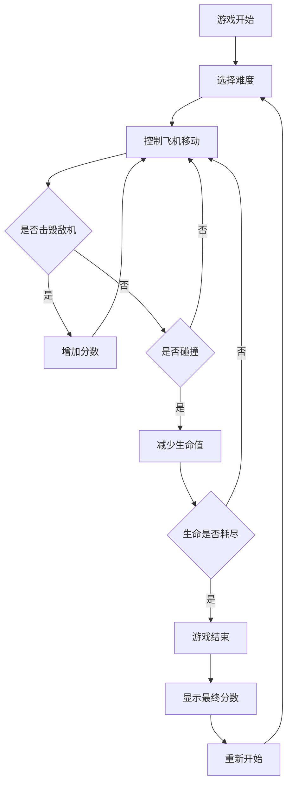

## 1. Product Overview
一款经典的飞机大战射击游戏，使用 HTML5 Canvas 技术实现。玩家操控飞机射击敌方飞机，获得分数并避免碰撞。

- 主要目标：提供娱乐性和挑战性，适合所有年龄段用户
- 产品价值：简洁、快速的休闲游戏体验

## 2. Core Features

### 2.1 User Roles
不需要用户角色区分，单玩家游戏

### 2.2 Feature Module
1. **游戏界面**: 游戏画布、分数显示、生命值显示
2. **游戏控制**: 键盘或触摸控制飞机移动、射击
3. **游戏逻辑**: 敌机生成、碰撞检测、分数计算
4. **游戏状态**: 开始游戏、游戏结束、重新开始

### 2.3 Page Details
| Page Name | Module Name | Feature description |
|-----------|-------------|---------------------|
| 游戏界面 | 游戏画布 | 渲染玩家飞机、敌机、子弹、爆炸效果 |
| 游戏界面 | 分数/生命值显示 | 实时显示当前分数和剩余生命 |
| 游戏界面 | 控制区域 | 游戏控制说明和操作按钮 |
| 游戏界面 | 游戏状态 | 开始画面、游戏中、游戏结束画面 |

## 3. Core Process
用户打开游戏页面 → 点击开始游戏 → 控制飞机移动和射击 → 击毁敌机获得分数 → 避免碰撞 → 生命值耗尽 → 显示最终分数 → 可重新开始

## 4. User Interface Design
### 4.1 Design Style
- **主色调**: 深空蓝 (#0a0e27) 和霓虹绿 (#00ff88)
- **次要色**: 霓虹红 (#ff3040) 和亮黄色 (#ffcc00)
- **设计风格**: 复古未来主义，带有霓虹灯效果
- **字体**: 使用像素风格字体，适合游戏场景
- **按钮风格**: 圆角霓虹边框按钮，点击有发光效果
- **布局**: 全屏游戏画布，状态信息固定在顶部

### 4.2 Page Design Overview
| Page Name | Module Name | UI Elements |
|-----------|-------------|-------------|
| 游戏界面 | 游戏画布 | 深色背景，星星滚动效果，彩色的飞机和子弹 |
| 游戏界面 | 分数显示 | 右上角，霓虹绿文字，实时更新 |
| 游戏界面 | 生命值显示 | 左上角，红色心形图标 |
| 游戏界面 | 开始画面 | 居中显示游戏标题、操作说明、开始按钮 |
| 游戏界面 | 结束画面 | 居中显示最终分数、重新开始按钮 |

### 4.3 Responsiveness
- 桌面端：支持键盘控制（方向键/WASD移动，空格键射击）
- 移动端：支持触摸控制，自适应屏幕尺寸
- 游戏画布自动适应窗口大小，保持宽高比

### 4.4 Animation and Effects
- 星星背景滚动动画
- 子弹发射特效
- 敌机爆炸粒子效果
- 霓虹光晕效果
- 按钮悬停和点击动画
